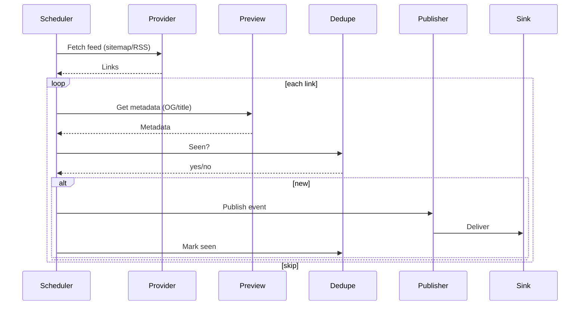

# `samvad-news-harvester`


[](https://github.com/OWNER/REPO/actions/workflows/ci.yml)


**Samvad News Harvester** is a tiny Go service that fetches news links from provider feeds, enriches them with lightweight metadata, and fans structured events out to queues or webhooks.
It is intentionally small, pluggable, and welcoming to new contributors.
The harvester only uses public sitemaps, or link lists, and never fetches or stores full article bodies.

---

## What it does

* Fetches links from providers defined in YAML/JSON config.
  Ships with a Google News sitemap fetcher tested across dozens of Indian news sources. *(ndtv, thehindu, timesofindia, financialexpress, etc.)*
* Enriches links with titles/descriptions/images using `goquery` (best effort; returns partial results on timeout or cancel).
* Publishes JSON events to multiple sinks (HTTP webhooks or queues: AWS SQS/SNS, GCP Pub/Sub) via a pluggable registry.
* Provides an optional dedupe layer (`bbolt` file by default) to skip previously published article IDs.

### Quick architecture sketch



---

## Prereqs

* Go 1.24+
* Access to whichever sinks you enable (webhook URL, SQS/SNS credentials, Pub/Sub topic, etc.)

---

## Quickstart (local)

1. **Providers**
   Edit `configs/providers.yaml` (or point `PROVIDERS_FILE` to your own).
   Always set a valid `user_agent`; headers are not defaulted.

2. **Publishers**
   Copy:

   ```bash
   cp configs/publishers.example.yaml configs/publishers.yaml
   ```

   Then disable sinks you don’t own (`enabled: false`) or set the env vars for the ones you keep.
   The example enables GCP Pub/Sub — toggle it off if you don't have creds.

3. **Run the harvester**

   ```bash
   go run ./cmd/harvester
   ```

   The process stays alive and runs every `CRAWL_INTERVAL` (default: 15m).

---

## Providers

Providers live in `configs/providers.yaml` (YAML or JSON).

**Google News example:**

```yaml
providers:
  - id: ndtv
    name: NDTV News
    type: google_news_sitemap
    source_url: https://www.ndtv.com/sitemap/google-news-sitemap
    response_format: xml
    request_delay_ms: 500
    config:
      user_agent: <required>   # must be set; headers are never defaulted
      accept: <optional>
      accept_language: <optional>
      cache_control: <optional>
```

### Adding a provider

1. **Another Google News sitemap**
   Add a new entry with `type: google_news_sitemap` and required headers.

2. **A new provider type**

   * Implement `pkg/providers.Fetcher`
   * Register it in `pkg/providers.DefaultFetcherRegistry`
   * Use its type (or override provider ID) in config

The fetcher interface ensures each provider stays isolated and pluggable.

---

## Publishers

Publishers live in `configs/publishers.yaml` (YAML or JSON).

Two top-level `type` values:

* `queue` (with `queue.provider`: `aws-sqs`, `aws-sns`, or `gcp`)
* `http` (generic webhook)

**Example (SQS):**

```yaml
publishers:
  - id: aws-sqs-queue
    type: queue
    enabled: true
    queue:
      provider: aws-sqs
      aws:
        uri: "${AWS_SQS_QUEUE_URL}"
        region: "${AWS_SQS_REGION}"
        access_key_id: "${AWS_SQS_ACCESS_KEY_ID}"
        secret_access_key: "${AWS_SQS_SECRET_ACCESS_KEY}"
```

Unknown or disabled publishers are ignored cleanly at runtime.

Secrets should always be set via env vars — never committed.

---

## Storage / Deduplication

The default dedupe backend is BoltDB.

Env vars:

* `STORAGE_TYPE=bbolt`
* `BBOLT_PATH=./data/cache.db`
* `STORAGE_TTL_SECONDS` controls retention
* `STORAGE_CLEANUP_INTERVAL_SECONDS` controls cleanup cadence

Disable dedupe with:

```
STORAGE_TYPE=none
```

---

## Development

* Run tests before sending changes:

  ```bash
  go test ./...
  ```

* Keep PRs small and focused. Prefer one provider per file and register via the fetcher registry.

* Logging uses `zap`.

* Provider and publisher implementations accept injected clients to make testing and mocking easy.

* Enable pre-commit formatting:

  ```bash
  make hooks
  ```

---

## Contributing

Issues and PRs are welcome — especially for:

* New providers (RSS, additional sitemap flavors)
* Retry/backoff helpers and scheduler improvements
* Non-Bolt storage options
* Additional publishers (Kafka, Azure Service Bus, etc.)

If you're unsure about scope, open an issue first — maintainers (me) reply quickly.

---

## License

Licensed under ISC (see `LICENSE`).
