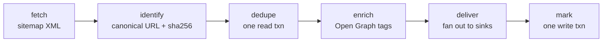

# samvad-news-harvester

[](https://github.com/samvad-hq/samvad-news-harvester/actions/workflows/ci.yml)

Samvad News Harvester crawls news sitemaps, identifies articles by a stable
ID, and delivers them as JSON events to one or more sinks (a webhook, a
queue, or just your own logs).

It reads **news sitemaps only, never RSS or Atom**. News sitemaps are
published specifically for crawler consumption and advertised from
`robots.txt`; many publishers, by contrast, restrict their RSS feeds to
personal, non-commercial use in their terms of service. This was a
deliberate scope decision, not an oversight.

The harvester never fetches or stores article bodies. It reads the `<head>`
of a page — Open Graph title, description and image — and nothing else.

## Quickstart

No account, no credentials, no cloud service. Clone it and run it:

```bash
git clone https://github.com/samvad-hq/samvad-news-harvester
cd samvad-news-harvester
cp configs/sources.example.yaml configs/sources.yaml
cp configs/sinks.example.yaml configs/sinks.yaml
go run ./cmd/harvester -once
```

The default sink writes each article to stdout, so this produces visible
output without an account anywhere. A real line from an actual run looks
like this:

```json
{"time":"2026-09-07T07:44:14.769744+05:30","level":"INFO","msg":"article","sink":"local-log","source_id":"livemint","source_name":"Mint","article_id":"6ae93468511dcc248bdadf592776cc6f31e8ed36ea23f820263eb5bee4100cff","title":"Nike's S&P 100 exit: Strategic blunders, fierce rivals, and the road to recovery, according to experts | Company Business News","url":"https://www.livemint.com/companies/nikes-s-p-100-exit-strategic-blunders-fierce-rivals-and-the-road-to-recovery-according-to-experts-11788742976902.html","published_at":"2026-09-07T02:03:34Z"}
```

(See [Event shape](#event-shape) below for the full JSON event a webhook or
queue sink receives — the log sink above prints a flattened subset of it.)
Swap in a webhook or a cloud queue by editing `configs/sinks.yaml` — see
[docs/configuration.md](docs/configuration.md).

`-once` runs a single crawl and exits; with no flags the process stays up
and crawls on `CRAWL_INTERVAL` (default 15m). `-validate` checks
`configs/sources.yaml` and `configs/sinks.yaml` without crawling anything:

```bash
go run ./cmd/harvester -validate
# configuration is valid: 26 sources, 1 sinks
```

**`-once`'s exit code.** The process exits non-zero only when *every*
configured source failed, not when any of them did. Some sources
answering 403 or timing out on a given run is expected — three of the 26
configured sources fail by design and have no working fixture — so
exiting non-zero on any single failure would give a cron wrapper a
permanently red exit code it learns to ignore. A total failure (every
source, none delivered) is the case actually worth surfacing to an
orchestrator. `-once` always logs the crawl's errors regardless of which
case it hits; only the exit code is conditional. The long-running mode
(no flags) never exits on crawl failures at all — see
[docs/architecture.md](docs/architecture.md#failure-handling).

## How it works


```mermaid
flowchart LR
    A[fetch<br/>sitemap XML] --> B[identify<br/>canonical URL + sha256]
    B --> C[dedupe<br/>one read txn]
    C --> D[enrich<br/>Open Graph tags]
    D --> E[deliver<br/>fan out to sinks]
    E --> F[mark<br/>one write txn]
```

Each source runs all five stages independently, up to `SOURCE_CONCURRENCY`
sources at once, and the two per-article stages — enrich and deliver — run
their articles concurrently within the stage, under their own limits. One
publisher answering 403 or timing out does not stop the others — see
[docs/architecture.md](docs/architecture.md) for why.

## Delivery is at-least-once

**An article is recorded as seen only once *every* enabled sink has
accepted it.** If one sink is down while the others succeed, the event is
redelivered to all of them on the next crawl — including the ones that
already got it. This is the correct trade against the alternative, which
is silently losing the article for the sink that was down.

**Consumers must key on `article.id`**, which is the SHA-256 of the
canonical URL and is stable across tracking parameters, trailing slashes,
and scheme/host case. It does not change across redeliveries, so
de-duplicating on it at the consumer is the correct and only way to get
exactly-once semantics out of an at-least-once feed.

**Events arrive in no particular order.** A source's articles are
delivered concurrently, so a sink receives them interleaved rather than in
the order the sitemap listed them. Order by `article.published_at` if
order matters.

## Event shape

A real event, captured by pointing an `http` sink at a local listener
during a `-once` run — this is the exact JSON body every non-log sink
receives:

```json
{
  "source_id": "thehindu",
  "source_name": "The Hindu",
  "article": {
    "source_id": "thehindu",
    "id": "0cf1a235fcf922532a34935e3aecb25bd078990129c5529964425960ffe4ceaf",
    "title": "Delhi building collapse: Death toll rises to six, 11 rescued from debris in Satya Niketan",
    "url": "https://www.thehindu.com/news/cities/Delhi/delhi-building-collapse-in-satya-niketan-death-toll-rises-september-7-2026-updates/article71437297.ece",
    "description": "Rescue operations continue in Delhi building collapse; 11 rescued, 6 confirmed dead, with investigations underway against the owner.",
    "image_url": "https://th-i.thgim.com/public/incoming/fg5nv/article71437294.ece/alternates/LANDSCAPE_1200/06th-SHRIMANSI-G94GGF0IR.3.jpg.jpg",
    "keywords": ["Delhi", "disaster management", "disaster and accident", "Breaking news", "accident (general)", "police", "death"],
    "published_at": "2026-09-07T02:09:14Z"
  },
  "collected_at": "2026-09-07T02:23:56.725342Z"
}
```

`article.original_url` appears only when the sitemap's link differed from
the canonical form (a tracking parameter, a trailing slash, mixed host
case). `article.description`, `image_url` and `keywords` are omitted when
nothing supplied them.

## Configuration

Everything is environment variables plus two YAML (or JSON) files:
`configs/sources.yaml` (what to crawl) and `configs/sinks.yaml` (where to
deliver). Full reference, including every environment variable and a
v1-to-v2 migration table: [docs/configuration.md](docs/configuration.md).

One source entry:

```yaml
sources:
  - id: thehindu
    name: The Hindu
    type: news_sitemap
    url: https://www.thehindu.com/sitemap/googlenews/all/all.xml
    headers:
      user_agent: "Mozilla/5.0 (compatible; samvad-harvester/2.0; +https://github.com/samvad-hq/samvad-news-harvester)"
```

One sink entry:

```yaml
sinks:
  - id: local-log
    type: log
    enabled: true
    log:
      level: info
```

## Blocked publishers

Three of the 26 configured sources — `ndtv`, `firstpost` and
`telegraphindia` — answered 403 to a direct request on 2026-09-06 and have
no recorded test fixture. The remedy is the per-source `proxy` field:

```yaml
  - id: ndtv
    name: NDTV
    type: news_sitemap
    url: https://www.ndtv.com/sitemap/google-news-sitemap
    proxy: ${PROXY_URL}
    headers: *default_headers
```

`${VAR}` is expanded from the environment at load time, so the proxy URL
itself never needs to be committed.

**A proxy addresses IP reputation, which is usually what is being
refused.** These publishers sit behind bot-management services that score
the requesting address, and a datacenter IP — a GCP or Railway egress, for
instance — is scored differently from a residential one. A residential
proxy is the practical remedy, and is why the `proxy` field exists.

It does not disguise the TLS handshake. `internal/httpx` uses Go's
standard `net/http`, so the ClientHello it sends carries Go's default
cipher and extension ordering, which is a stable JA3/JA4 signature that
does not resemble any browser's. A publisher fingerprinting at that layer
can still refuse a request that arrives from a clean address. Nothing in
the Go standard library changes this; it would take a client that builds
its own ClientHello. That is not something this service does today, and
adding it is not currently planned.

## Adding a source type

`Fetcher` is not a Go interface you import. Write a concrete type with a
`Fetch` method; Go's structural typing does the rest — nothing declares
that your type implements anything. For example, a publisher that exposes
its own JSON article-listing API rather than a sitemap:

```go
// internal/source/jsonapi.go
type JSONAPI struct{ /* ... */ }

func (j *JSONAPI) Fetch(ctx context.Context, src source.Config) ([]news.Article, error) {
	// return articles with ID = news.ID(canonicalURL) and
	// URL = canonicalURL, where canonicalURL, err := news.CanonicalURL(link)
}
```

(This is a hypothetical for illustration — no such fetcher exists today.
`news_sitemap`, wired below, is the only one that does.)

Then register the type in `cmd/harvester/main.go`. The real map, as it
exists today, has exactly one entry:

```go
// cmd/harvester/main.go — current state
Fetchers: map[string]harvest.Fetcher{
	source.TypeNewsSitemap: source.NewSitemap(fetchClients, log),
},
```

Adding the hypothetical `JSONAPI` type above would mean adding a second
entry to that same map:

```go
// cmd/harvester/main.go — after adding JSONAPI (illustrative, not current)
Fetchers: map[string]harvest.Fetcher{
	source.TypeNewsSitemap: source.NewSitemap(fetchClients, log),
	source.TypeJSONAPI:     source.NewJSONAPI(fetchClients, log),
},
```

along with a `TypeJSONAPI` constant and a `NewJSONAPI` constructor in
`internal/source` — neither of which exists yet. Define your own `TypeXxx`
constant, accept it in `source.Config.Validate`, and add your own entry to
the map. That is the whole contract — there is no registry to update and
no interface to satisfy explicitly.

## Adding a sink

Implement `sink.Sink` (`Name() string` and `Send(ctx, news.Event) error`),
add a config block next to `HTTPConfig`/`SQSConfig` in
`internal/sink/config.go`, and add a `case` for it in the `build` function
in `internal/sink/build.go`. `sink.Sink` is the one interface in this
service that is exported for a real reason: five implementations (log,
http, aws-sqs, aws-sns, gcp-pubsub) are selected at runtime from
configuration.

## Development

```bash
make test                    # go test ./...
make race                    # go test -race ./...
make lint                    # go vet + golangci-lint
scripts/capture-fixtures.sh  # re-record sitemap XML fixtures
```

Sitemap fixtures under `internal/source/testdata/` are committed on
purpose: publisher XML drifts, and a shape change is exactly the failure
that should break CI instead of reaching production silently. Re-run
`scripts/capture-fixtures.sh` when adding a source or when a live parse
starts failing, and commit the result.

## License

ISC — see [LICENSE](LICENSE).
